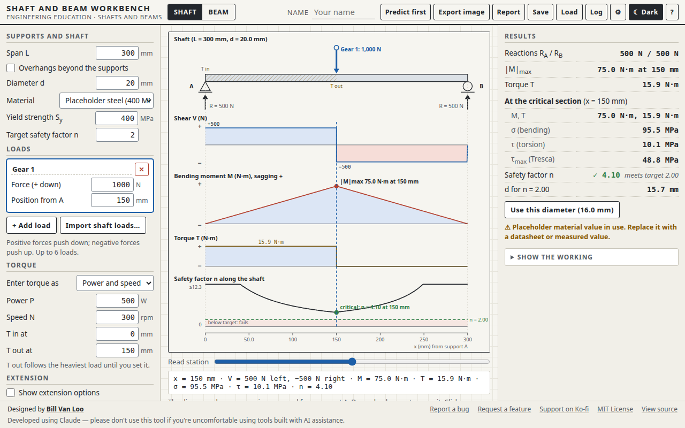

# Shaft and Beam Workbench

A browser tool for learning how shafts and beams carry load. Students place bearings and loads on a shaft, then see:

- the support reactions
- the shear force and bending moment diagrams
- the torque the shaft carries
- the bending and torsional stresses
- the safety factor at every station, and the critical section
- the diameter needed for a target safety factor

It turns the hardest example problem in the unit into one students can predict one step at a time, then check.

Part of **[Engineered by the Numbers](https://github.com/billvanloo/EngineeredByTheNumbers)**, a Principles of Engineering unit (modules 4 and 5).



## Quick start

**Online:** enable GitHub Pages for this repo (Settings → Pages → Deploy from a branch → `main`, `/ (root)`) and share the URL.

**Offline:** download `index.html` and open it in any current browser. It's one self-contained file with no network calls, and works on a Chromebook.

## What students do

- **Two modes.** *Shaft* mode covers bending and torque. *Beam* mode covers bending only.
- **Loads.** Up to six point loads: drag them, type positions, or place them with the keyboard. Overhangs beyond either bearing are optional.
- **Torque.** Enter it directly, or as power and speed (T = P/ω). It's carried between a *T in* and a *T out* station.
- **Diagrams.** Stacked on one x axis: shaft, shear, bending moment, torque, and safety factor along the shaft. Click any diagram, or use the slider, to read V, M, T, σ, τ and n at that station.
- **Failure rules.** Maximum shear stress (Tresca) is the default. Distortion energy (von Mises), stress concentration factors K<sub>b</sub> and K<sub>t</sub>, and the deflected shape are extension options.
- **Required diameter.** Solved for the target safety factor. *Use this diameter* rounds it up to the next 0.5 mm.
- **Predict first.** R<sub>A</sub>, |M|<sub>max</sub>, the safety factor and the required diameter stay hidden until the student enters predictions and presses Check. Every attempt goes to the prediction log.
- **Show the working.** Every step with the formula, the substituted numbers and units, the result and its source.
- **Saving and exports.** Save and Load design files; export a PNG (2×, ink on paper, with a caption strip); print a report; export the prediction log (JSON or CSV).

## Teacher notes

- **Placeholder materials.** The yield strength and modulus presets (steel 400 MPa, aluminum 250 MPa, brass 200 MPa) are placeholders. Replace them with datasheet or measured values. The readout flags placeholder values in use.
- **Model scope.** Version 1 models one solid round shaft of uniform diameter on a pin (A) and a roller (B), with all loads in one plane. Loads in two perpendicular planes, stepped and hollow shafts, fatigue and bearing life are out of scope for now.
- **Imports.** The tool imports `shaft-loads` files from the Gear Train Workbench and the Conveyor Designer (drop the file on the page or use Load). If the loads point in different directions, the tool says so and uses their magnitudes.
- **Prediction logs.** They use the shared format, so a class set can be merged in the Prediction Log Collector. Nothing leaves the student's browser.

## How it connects to the other tools

| File | Direction |
|---|---|
| `shaft-loads` JSON | **In**, from the Gear Train Workbench (tooth forces) and the Conveyor Designer (pulley side load) |
| `prediction-log` JSON/CSV | **Out**, to the Prediction Log Collector |

The formats are documented in [`EngineeredByTheNumbers/ecosystem/schemas.md`](https://github.com/billvanloo/EngineeredByTheNumbers/blob/main/ecosystem/schemas.md).

## Development

```
node dev/test.js          # 75 checks: every spec test case SB-1 to SB-15, plus a CD-10 cross-check
node dev/verify-html.js   # inline code in index.html matches dev/core.js and dev/vendor/; runs spec cases on it
node dev/e2e.js           # 101 browser checks in headless Chromium (needs Playwright, see below)
```

- **Where the code lives.** `dev/core.js` is the tool's calculation layer: SI at the edges, working steps, description, import. `dev/vendor/` holds shared code from the Engineered by the Numbers `ecosystem/`: the beam model, the tool shell, the prediction log and the file schemas. Don't edit vendored files here. Change them in the EngineeredByTheNumbers repo and run its `scripts/sync-vendor.js`.
- **Changing the core.** Edit `dev/core.js`, run `node dev/test.js`, then `node dev/verify-html.js --fix` to copy it into `index.html`.
- **Playwright for the e2e checks.** It isn't a project dependency. Once, from the repo root: `npm i --no-save playwright && npx playwright install chromium`. You can also set `CHROMIUM_PATH` to an installed Chromium.
- **Performance.** A full re-solve and redraw with six loads and deflection on takes about 16 ms in headless Chromium (target: under 50 ms). See `docs/screenshots/perf.txt`.

The spec this tool was built from is in [`docs/spec.md`](docs/spec.md), with the shared conventions in [`docs/conventions.md`](docs/conventions.md).

This was built using Claude. Please don't use this tool if you have qualms about using code created with AI tools.
